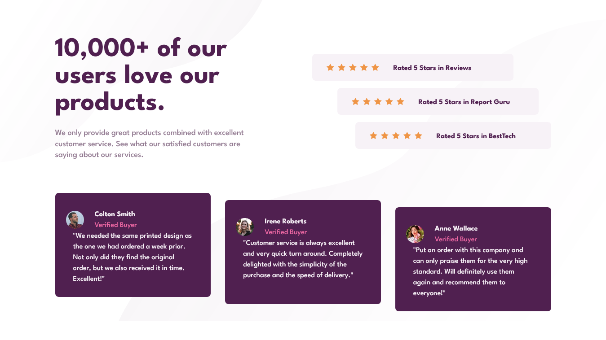

# Frontend Mentor - Social proof section solution

This is a solution to the [Social proof section challenge on Frontend Mentor](https://www.frontendmentor.io/challenges/social-proof-section-6e0qTv_bA). Frontend Mentor challenges help you improve your coding skills by building realistic projects.

## Table of contents

- [Overview](#overview)
  - [The challenge](#the-challenge)
  - [Screenshot](#screenshot)
  - [Links](#links)
- [My process](#my-process)
  - [Built with](#built-with)
  - [What I learned](#what-i-learned)
  - [Continued development](#continued-development)
- [Author](#author)

**Note: Delete this note and update the table of contents based on what sections you keep.**

## Overview

### The challenge

Users should be able to:

- View the optimal layout for the section depending on their device's screen size

### Screenshot

### Links

- Solution URL: [source code](https://github.com/SilvanosEric/social-proof-section)
- Live Site URL: [website](https://silvanoseric.github.io/social-proof-section/)

## My process

### Built with

- Semantic HTML5 markup
- CSS custom properties
- Flexbox
- CSS Grid
- Mobile-first workflow
- [tailwindcss](https://tailwindcss.com/)
- [CUBE CSS](https://cube.fyi/)
- [BEM](http://getbem.com/)
- [vite](https://vitejs.dev/)

### Continued development

- CUBE CSS ([Grouping](https://cube.fyi/grouping.html))

## Author

- Frontend Mentor - [@SilvanosEric](https://www.frontendmentor.io/profile/SilvanosEric)
